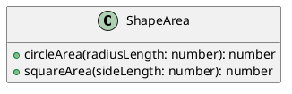
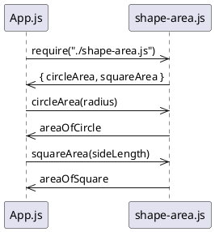

Complete the program, app.js.

First, import the shape-area.js module using the require() function (shape-area.js is in the same folder as app.js). Choose one of the two options below for storing the returned module.exports object:

A) Store the entire module.exports object in the variable areaFunctions.
B) Use object destructuring to extract the .circleArea() and .squareArea() methods into their own variables, circleArea and squareArea.
Next, call the circleArea() function with the provided variable radius as an input. Assign the returned value to the variable areaOfCircle.

Then, call the squareArea() function with the provided variable sideLength as an input. Assign the returned value to the variable areaOfSquare.

You may print the values of areaOfCircle and areaOfSquare to the console to see your code work!

Hint

To import a module in the same folder, use the following syntax:
require('./name-of-file.js')
# Shape Area Module

This module provides functions for calculating the area of shapes.

## Installation

To use this module, simply require it in your JavaScript file:
```javascript
const { circleArea, squareArea } = require("./shape-area.js");
```

## Functions

### circleArea(radiusLength)

Calculates the area of a circle.

* `radiusLength`: The radius of the circle.
* Returns: The area of the circle.

### squareArea(sideLength)

Calculates the area of a square.

* `sideLength`: The length of a side of the square.
* Returns: The area of the square.

## Example Usage

```javascript
const radius = 5;
const sideLength = 10;

const areaOfCircle = circleArea(radius);
const areaOfSquare = squareArea(sideLength);

console.log("Area of circle:", areaOfCircle);
console.log("Area of square:", areaOfSquare);
```

## PlantUML Diagrams

### Class Diagram


### Sequence Diagram
