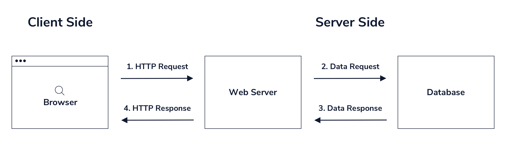

>Setting up a Server with HTTP
# Interacting with a Database

While we have encountered simple examples of servers handling HTTP 
Preview: Docs Loading link description requests , some requests require a bit more work than returning a simple string such as 'Hello World'. In real-world applications, servers are responsible for helping to persist and retrieve data, usually through interaction with a database.

Databases are remote resources to which the server must make a request. When this happens, the server making the request 
Preview: Docs Functions are reusable pieces of code that perform tasks, process data, and possibly return values.
functions as the client, sending HTTP messages to the database server. Databases usually have their own Software Development Kits (SDKs) and Object-Relational Mapping (ORMs) that can be used to connect to them easily. But with the right information, requests could potentially be made in a raw form directly from your server using something like the HTTP .request() method.



As seen in the diagram above, a single server often does not represent the final destination in processing a request from a client. Instead, a client sends a request, which is then processed partially, generating a separate HTTP request from the server to the database. When received, the server waits for the database’s response and will ultimately relay that information as a response back to the original caller.

# Here’s a simple explanation of the code:

```javascript
// 1. Importing Modules:
//* http: Used to create an HTTP server.
//* fs: Used to interact with the file system, specifically to read files.

const http = require("http");
const fs = require("fs");

// 2. GET request handler:
// * handleGetRequest: A function that handles GET requests. It checks if the request URL is /users.
// * If the URL is /users, it calls makeDatabaseRequest to fetch data from a file named database.json.
//* If there’s an error reading the file, it responds with a 400 status code and an error message.
//* If successful, it responds with a 200 status code and the data as a JSON string.

const handleGetRequest = (req, res) => {
  if (req.url === "/users") {
    // Loads the database and searches for data
    makeDatabaseRequest("users", (err, payload) => {
      if (err) {
        res.writeHeader(400);
        res.write("Error retrieving data");
      } else {
        // Process successful request
        res.writeHeader(200, { "Content-Type": "application/json" });
        res.write(JSON.stringify(payload));
      }
      res.end();
    });
  }
};

// 3. Creates server instance:
//* http.createServer: Creates an HTTP server that listens for requests.
//* It checks the request method. If it’s GET, it calls handleGetRequest. Otherwise, it throws an error for unsupported methods.

const server = http.createServer((req, res) => {
  const { method } = req;

  switch (method) {
    case "GET":
      return handleGetRequest(req, res);
    default:
      throw new Error(`Unsupported request method: ${method}`);
  }
});

// 4. Starts server listening on specified port
// * server.listen(4001): Starts the server on port 4001.
// * Logs the server’s address and port once it starts listening.

server.listen(4001, () => {
  const { address, port } = server.address();
  console.log(`Server is listening on: http://${address}:${port}`);
});

//  5. Database Request Function:

// makeDatabaseRequest: Reads database.json and extracts data based on the type parameter.
// Calls a callback function with the data or an error.

function makeDatabaseRequest(type, cb) {
  fs.readFile("./database.json", "utf8", function (err, payload) {
    if (err) {
      cb(err, null);
    } else {
      cb(null, JSON.parse(payload)[type]);
    }
  });
}
```

