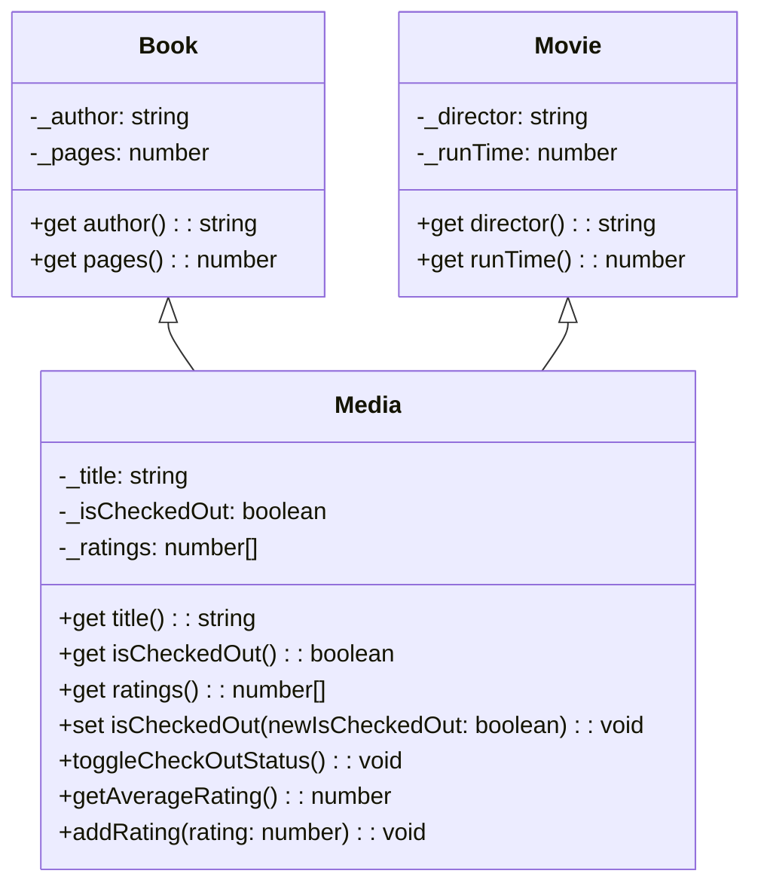

Here's a UML class diagram for the "Build a Library" project based on the provided JavaScript classes:

Here's a brief explanation of the diagram:

1. The `Media` class is the base class with attributes like `_title`, `_isCheckedOut`, and `_ratings`. It has getter and setter methods for the title and isCheckedOut properties, as well as methods to toggle the checked-out status, calculate the average rating, and add a new rating.
2. The `Book` class extends the `Media` class and adds attributes specific to books, such as `_author` and `_pages`. It also has getter methods for these properties.
3. The `Movie` class extends the `Media` class and adds attributes specific to movies, such as `_director` and `_runTime`. It also has getter methods for these properties.
4. The relationships between the classes are indicated by the arrows. The `Book` and `Movie` classes inherit from the `Media` class, as shown by the `<|--` notation.