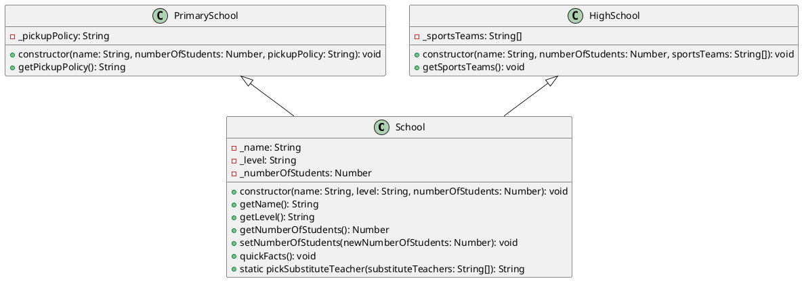

Based on the provided `School Catalogue` project description, here's a PlantUML class diagram for the project:

Here's a brief explanation of the diagram:

1. The `School` class is the base class with attributes like `name`, `level`, and `numberOfStudents`. It has getter and setter methods for these properties, as well as a `quickFacts()` method and a static `pickSubstituteTeacher()` method.
2. The `PrimarySchool` class extends the `School` class and adds an attribute specific to primary schools, `pickupPolicy`. It also has a getter method for this property.
3. The `HighSchool` class extends the `School` class and adds an attribute specific to high schools, `sportsTeams`. It also has a getter method for this property that logs the sports teams to the console.
4. The relationships between the classes are indicated by the arrows. The `PrimarySchool` and `HighSchool` classes inherit from the `School` class, as shown by the `<|--` notation.

